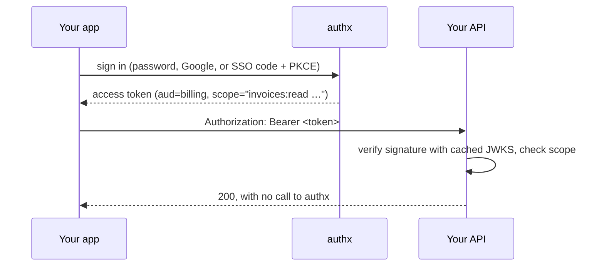

# authx

**Self-hosted auth for TypeScript backends. Your services verify tokens
themselves. No callback to the auth server on every request.**

[](https://github.com/ramilvillon/authx/actions/workflows/ci.yml)
[](https://github.com/ramilvillon/authx/actions/workflows/e2e.yml)
[](LICENSE)

authx gives you users, organizations and per-service roles, and issues signed
JWTs that carry exactly what a user may do **in one service**. Each service
checks the signature against a public key set (JWKS) and reads the permissions
straight from the token. Hosted-auth ergonomics, on infrastructure you own,
under the MIT license.

## Why authx

- **No auth round-trip.** RS256 tokens verified locally against
  `/.well-known/jwks.json`. While the keys are cached, your APIs keep verifying
  even if authx is briefly down.
- **Permissions in the token.** Ask for a token for `audience=billing` and its
  `scope` holds that user's billing permissions and nothing else.
- **Standard OAuth 2.0 and OpenID Connect.** Authorization code + PKCE, refresh
  rotation with reuse detection, `client_credentials`, discovery, UserInfo. Any
  standard OAuth or OIDC client library works.
- **Built for service backends.** Multi-org tenancy, machine-to-machine tokens,
  a management API, and a type-safe RPC client for TypeScript callers.
- **Small and readable.** Deno + Hono + Drizzle + MySQL. No JVM, no plugin
  system to learn.

## How it works



## Features

| Area               | What you get                                                                                                                            |
| ------------------ | --------------------------------------------------------------------------------------------------------------------------------------- |
| **Sign-in**        | Email + password, Sign in with Google, passkeys, SSO login page, TOTP two-factor with recovery codes, guest accounts that upgrade later |
| **Protocols**      | OAuth 2.0 (password, refresh, authorization code + PKCE, client credentials), OIDC `id_token` + UserInfo                                |
| **Authorization**  | Organizations, services, roles and permissions; audience-scoped tokens; M2M principals with their own roles                             |
| **Account safety** | Email verification, password reset, confirmed email change and deletion, soft delete with a grace period                                |
| **Token security** | Refresh rotation with reuse detection, key rotation via `kid`, `client_secret_basic` / `client_secret_post`                             |
| **Operations**     | Rate limiting, proxy-aware client IPs, OpenAPI spec + Scalar docs at `/docs`, one-command local stack                                   |

## Quickstart

Needs [Deno](https://deno.com) and a Docker engine (Docker Desktop or
[Colima](https://github.com/abiosoft/colima)).

```bash
git clone https://github.com/ramilvillon/authx && cd authx
make setup      # writes .env with a fresh JWT keypair
# set BOOTSTRAP_ADMIN_EMAIL and BOOTSTRAP_ADMIN_PASSWORD in .env
make bootstrap  # starts MySQL + Mailpit, migrates, seeds your admin
make dev        # API on http://localhost:3000, API docs at /docs
```

Get a token (form-encoded, as RFC 6749 specifies):

```bash
curl -X POST localhost:3000/oauth/token \
  -d grant_type=password -d audience=platform \
  -d username=<admin email> -d password=<admin password>
```

Verify it in any service, with no call to authx, for example with
[`jose`](https://github.com/panva/jose):

```ts
import { createRemoteJWKSet, jwtVerify } from 'jose'

const jwks = createRemoteJWKSet(
  new URL('http://localhost:3000/.well-known/jwks.json'),
)

const { payload } = await jwtVerify(token, jwks, {
  issuer: 'http://localhost:3000',
  audience: 'platform', // your service's audience
})
const can = (perm: string) => String(payload.scope).split(' ').includes(perm)
```

Emails land in Mailpit at http://localhost:8025.

## Common flows

**Browser / mobile sign-in (authorization code + PKCE).** Send the user to
`/oauth/authorize?client_id=…&redirect_uri=…&code_challenge=…&code_challenge_method=S256`.
They sign in with a password or Google, you get `?code=` back, and you exchange
it at `/oauth/token`. Add `scope=openid email profile` to get an `id_token`.

**Two-factor (TOTP).** Set `TOTP_ENCRYPTION_KEY`, then users turn it on with
`POST /users/me/totp` with their `current_password`, or a Google-only user right
after a `prompt=login` sign-in (show the returned `otpauth_uri` as a QR code)
and `POST /users/me/totp/confirm`, which returns ten one-time recovery codes.
From then on the hosted login page asks for a code after the password or Google,
and the password grant answers `mfa_required`. See the
[API reference](docs/api.md).

**Passkeys.** Set `WEBAUTHN_RP_ID` and the hosted login page adds a "Sign in
with a passkey" button plus autofill, and offers to create one right after a
password, TOTP or Google sign-in. A passkey sign-in skips the TOTP prompt. List
and delete your own passkeys with `GET`/`DELETE /users/me/passkeys`. See the
[API reference](docs/api.md#passkeys-webauthn).

**Service to service.** A confidential service trades its credentials for a
short-lived token scoped to the target service:

```bash
curl -X POST localhost:3000/oauth/token -u '<client_id>:<client_secret>' \
  -d grant_type=client_credentials -d audience=<target-audience>
```

**Games and mobile apps.** Start players as guest accounts and bind Google later
without losing progress. See [guest accounts](docs/guest-accounts.md).

## Documentation

| Guide                                    | What's in it                                                      |
| ---------------------------------------- | ----------------------------------------------------------------- |
| [API reference](docs/api.md)             | Every endpoint, the management API, OAuth/OIDC flows, error codes |
| [Configuration](docs/configuration.md)   | All environment variables, Google sign-in setup, proxies          |
| [Guest accounts](docs/guest-accounts.md) | Guest sign-up, Google binding, client integration notes           |
| [Deployment](docs/deployment.md)         | Production checklist, migrations, scheduling `db:prune`           |
| [Development](docs/development.md)       | Local stack, make targets, test suites, database tasks            |

Running your own instance? Read [Deployment](docs/deployment.md) first. One
step, scheduling `db:prune`, is easy to miss and nothing fails loudly without
it.

## Contributing

Issues and pull requests are welcome. `npm install` sets up a pre-commit hook
(gitleaks, fmt, lint, type-check); `make test` runs the unit and integration
suites. See [Development](docs/development.md).

## License

[MIT](LICENSE)
